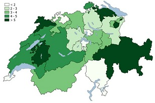
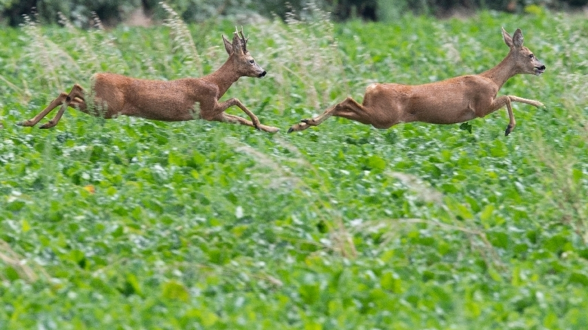

```{r knitr-setup, include = FALSE}
library(knitr)
opts_chunk$set(echo = FALSE, include = FALSE)
```


```{r flextable-setup}
library(flextable)
set_flextable_defaults(
  fonts_ignore=TRUE,
  font.size = 10,
  font.color = "black",
  table.layout = "fixed",
  digits = 1,
  theme_fun = "theme_box"
  )
```

Analysis of Road Accidents in Switzerland
=========================================

For this analysis a data set is provided by the *"Bundesamt für Strassen ASTRA"* in Switzerland. This data set contains accidents from 2011 to 2020, including for example the severity of the accident, whether a motorcycle, pedestrian or a bicycle was included.

This analysis is focused on accidents involving bicycles as well as animals. Furthermore the data set is getting extended with the population data from the 26 cantons of Switzerland and the LV03 Coordinates of the Cantons for a geographic map of Switzerland. Lastly, we added a fictitious data set to work with missing values. We assume that AXA gave us an excel file that records the amount of damage per accident event.


Reference to the data sources
------------------------------
1. **[Road Accidents](https://data.geo.admin.ch/ch.astra.unfaelle-personenschaeden_alle/)**
2. **[Population of Switzerland](https://www.bfs.admin.ch/bfs/de/home/statistiken/bevoelkerung.assetdetail.18344208.html)**
3. For the map: **[G1K09.shp](https://elearning.hslu.ch/ilias/goto.php?target=file_5315915_download&client_id=hslu)**
4. For the map: **[LV03 coordinates](https://map.geo.admin.ch/)** for an exemplary city within a canton. 
5. AXA damage reports per road accident (fictitious dataset).


Use Case
------------------------------
In our use case we both work for the *"Bundesamt für Strassen ASTRA"* as Data Analysts. We receive two different requests about the influence of traffic accidents in Switzerland.

1. **The first request** comes from the nature conservation organization *"Pro Natura"*, which would like to work with the "Bundesamt für Strassen ASTRA". Pro Natura needs an analysis of all wildlife accidents in Switzerland. They ask which cantons are particularly affected by wildlife accidents, at which time of the day and in which months there is the highest danger. Based on this, they want to push for stronger measures in the respective cantons to better protect wildlife. Such could include, for example: Building wildlife bridges or expanding those, introducing speed limits, or putting up traffic signs. 
They are also interested in whether their past measures have been successful and whether the number of wildlife accidents has already decreased.

2. **The second request** deals with bicycle accidents in Switzerland. ASTRA would like to have more information on where accidents involving bicycles are occuring, specifically in which canton. Further more they would like to have a brief overview of the accidents which involve bicycles. With this information ASTRA will then be able to reach out to the cantons and ask them to further analyse the bicycle-accidents and the possible indicators of these accidents.


\pagebreak


```{r Data Preparation}

library(dplyr)
library(ggplot2)
library(plotly)
library(tidyr)
library(stringr)
library(readxl)
library(gridExtra)
library(sf)
library(tidyverse)
library(osmdata)
library(ggmap)
library(tidyquant)
library(scales)
library(flextable)
library(knitr)


setwd("C:/Users/danie/OneDrive/Dokumente/HSLU Master/Module/R-Bootcamp/GroupProject/data")
#setwd("C:/Users/lukas/OneDrive/Studium/Masterstudium/HS2021/R_Bootcamp/Assignment/Data")

accidents <- read.csv("RoadTrafficAccidentLocations.csv", sep = ",", header = TRUE)

# Inspect the dataset:
head(accidents)

str(accidents)  


# Data Manipulation and Preprocessing

#Deselect / Cut the columns we dont need:
accidents_cut <- accidents %>% select (-c(
                          AccidentType,
                          AccidentType_de,
                          AccidentType_fr,
                          AccidentType_it,
                          AccidentSeverityCategory,
                          AccidentSeverityCategory_de,
                          AccidentSeverityCategory_fr,
                          AccidentSeverityCategory_it,
                          RoadType,
                          RoadType_de,
                          RoadType_fr,
                          RoadType_it,
                          AccidentMonth_de,
                          AccidentMonth_fr,
                          AccidentMonth_it,
                          AccidentWeekDay,
                          AccidentWeekDay_de,
                          AccidentWeekDay_fr,
                          AccidentWeekDay_it))

# Cleaning the data: In column "MunicipalityCode": If there is a zero at the end
# of the code is is not shown, therefore - if code consists of 3 integers = add 
# a zero at the end:
accidents_cut$MunicipalityCode <- str_pad(accidents_cut$MunicipalityCode, width = 4, side = "right", pad = "0")

#Add a column with digits from 1,2,3,4,...,178217 --> as unique row id:
accidents_cut$ID <- seq.int(nrow(accidents_cut))

#Add a column with only ones:
accidents_cut$Occurence <- 1

#Recode Weekday as a number
accidents_cut$AccidentWeekDay_Nr <- recode(accidents_cut$AccidentWeekDay_en, 
                        "Monday" = "1",
                        "Tuesday" = "2",
                        "Wednesday" = "3",
                        "Thursday" = "4",
                        "Friday" = "5",
                        "Saturday" = "6",
                        "Sunday" = "7",)

#Transforming variables
accidents_cut$AccidentYear <- as.factor(accidents_cut$AccidentYear)
accidents_cut$AccidentMonth <- as.factor(accidents_cut$AccidentMonth)
accidents_cut$RoadType_en <- as.factor(accidents_cut$RoadType_en)
accidents_cut$MunicipalityCode <- as.integer(accidents_cut$MunicipalityCode)
accidents_cut$AccidentMonth_en <- as.factor(accidents_cut$AccidentMonth_en)
accidents_cut$AccidentWeekDay_en <- as.factor(accidents_cut$AccidentWeekDay_en)
accidents_cut$AccidentType_en <- as.factor(accidents_cut$AccidentType_en)
accidents_cut$AccidentSeverityCategory_en <- as.factor(accidents_cut$AccidentSeverityCategory_en)
accidents_cut$AccidentInvolvingPedestrian <- as.logical(accidents_cut$AccidentInvolvingPedestrian)
accidents_cut$AccidentInvolvingBicycle <- as.logical(accidents_cut$AccidentInvolvingBicycle)
accidents_cut$AccidentInvolvingMotorcycle <- as.logical(accidents_cut$AccidentInvolvingMotorcycle)
accidents_cut$AccidentHour_text <- as.factor(accidents_cut$AccidentHour_text)
accidents_cut$CantonCode <- as.factor(accidents_cut$CantonCode)
accidents_cut$AccidentWeekDay_Nr <- as.factor(accidents_cut$AccidentWeekDay_Nr)


```

1. Analysis of Total Road Accidents in Switzerland 2011 - 2020
=======================================

First the total accidents in Switzerland between 2011 - 2020 are getting examined. It can be seen that the total amount of road accidents is more or less stable with a slight decreasing trend. However the total number for 2020 is lower compared to previous years. This is most likely affected to the Covid-19 Pandemic with let to a lockdown in the second quarter of 2020 with led to less traffic on the road.
Details on [Bundesamt für Statistik](https://www.bfs.admin.ch/bfs/de/home/statistiken/mobilitaet-verkehr/personenverkehr/leistungen.html).

```{r Data Visualisation Total, echo=FALSE, include = TRUE, out.width="70%", fig.align="center"}
color_palette <- c("#006D2C","#31A354","#74C476","#A1D99B","#C7E9C0","#EDF8E9")
# Histogram: Total Accidents from 2011 - 2020:
accidents_cut %>% ggplot(mapping = aes(x = AccidentYear)) +
  geom_bar(stat = "count",
           fill = "#006D2C") +
  geom_hline(yintercept = 5000, linetype = "dashed", col = "darkgrey") +
  geom_hline(yintercept = 10000, linetype = "dashed", col = "darkgrey") +
  geom_hline(yintercept = 15000, linetype = "dashed", col = "darkgrey") +
  geom_hline(yintercept = 20000, linetype = "dashed", col = "darkgrey") +
  ggtitle("Road Accidents in Switzerland from 2011 - 2020") +
  labs(x = "", y = "") +
  theme_minimal()
```

The total road accidents are also categorised by their severity. The categorisation has three variables: Accident with fatalities, Accident with light injuries and Accidents with severe injuries. Below the three different severity types are plotted with their corresponding occurence per year. It can be seen that the overall number of accidents is decreasing as well as all the corresponding severity types are decreasing as well. However the accidents with fatalities have been increasing significantly in 2020 compared to 2019.
\pagebreak

```{r Data Visualisation Total by Severity, include = TRUE, echo=FALSE, fig.align="center"}
plot_accidents1 <- accidents_cut[accidents_cut$AccidentSeverityCategory_en %in% c("Accident with fatalities"),] %>%
  ggplot(mapping = aes(x = AccidentYear)) +
  geom_bar(stat = "count",
           fill = "#006D2C") +
  geom_hline(yintercept = 100, linetype = "dashed", col = "darkgrey") +
  geom_hline(yintercept = 200, linetype = "dashed", col = "darkgrey") +
  geom_hline(yintercept = 300, linetype = "dashed", col = "darkgrey") +
  ggtitle("Road Accidents in CH with fatalities from 2011 - 2020") +
  theme_minimal() +
  labs(x = "", y = "") +
  theme(plot.title = element_text(size = 4,face = "bold"),
        axis.text.x = element_text(size=4),
        axis.text.y = element_text(size=4))
plot_accidents2 <- accidents_cut[accidents_cut$AccidentSeverityCategory_en %in% c("Accident with severe injuries"),] %>%
  ggplot(mapping = aes(x = AccidentYear)) +
  geom_bar(stat = "count",
           fill = "#31A354") +
  geom_hline(yintercept = 1000, linetype = "dashed", col = "darkgrey") +
  geom_hline(yintercept = 2000, linetype = "dashed", col = "darkgrey") +
  geom_hline(yintercept = 3000, linetype = "dashed", col = "darkgrey") +
  geom_hline(yintercept = 4000, linetype = "dashed", col = "darkgrey") +
  ggtitle("Road Accidents in CH with severe injuries from 2011 - 2020") +
  theme_minimal() +
  labs(x = "", y = "") +
  theme(plot.title = element_text(size = 4,face = "bold"),
        axis.text.x = element_text(size=4),
        axis.text.y = element_text(size=4))
plot_accidents3 <- accidents_cut[accidents_cut$AccidentSeverityCategory_en %in% c("Accident with light injuries"),] %>%
  ggplot(mapping = aes(x = AccidentYear)) +
  geom_bar(stat = "count",
           fill = "#74C476") +
  geom_hline(yintercept = 5000, linetype = "dashed", col = "darkgrey") +
  geom_hline(yintercept = 10000, linetype = "dashed", col = "darkgrey") +
  geom_hline(yintercept = 15000, linetype = "dashed", col = "darkgrey") +
  ggtitle("Road Accidents in CH with light injuries from 2011 - 2020") +
  theme_minimal() +
  labs(x = "", y = "") +
  theme(plot.title = element_text(size = 4, face = "bold"),
        axis.text.x = element_text(size=4),
        axis.text.y = element_text(size=4))
grid.arrange(plot_accidents1, plot_accidents2, plot_accidents3, ncol = 3)
```

2. Analysis of Road Accidents with Animal Involvement 
=======================================

After looking broadly on the data we now dig deeper to find answers to the two use-cases. First we examine the accidents where animals were involved.

Pre-Processing as Chapter of Choice
----------------------------------------

In a first step we load the data from "Bundesamt für Strassen" and enrich it with population data for the different cantons in Switzerland. For this, we wanted to learn how to do a loop combined with if-else branching and used this to import and preprocess the data in the Excel File "PopulationCH". The main part of the code deals with the fact that each sheet in the Excel file creates a new object (data frame). 

Besides, we introduce a new column **CantonCode**, which we will need later for joining with the other dataset. An example sheet reduced to its most essential looks like this:

```{r Chapter of Choice,  message="Loop was successful"}

#Using for Loops and If/Else Statements for Data Manipulation

setwd("C:/Users/danie/OneDrive/Dokumente/HSLU Master/Module/R-Bootcamp/GroupProject/data")

vector_of_canton_code <-  c("AG","AR","AI","BL","BS","BE","","FR","GE","","GL","GR","JU","LU","NE","NW","","OW","",
                            "SH","SZ","SO","SG","TI","TG","UR","VD","VS","","ZG","ZH")


#Loop through an excel file:
xlsx_file <- "PopulationCH.xlsx"
mysheet_list_columns <- c ("population_CH_2020","population_CH_2019","population_CH_2018","population_CH_2017","population_CH_2016","population_CH_2015",
                  "population_CH_2014","population_CH_2013","population_CH_2012","population_CH_2011","population_CH_2010","population_CH_2009",
                  "population_CH_2008","population_CH_2007","population_CH_2006","population_CH_2005","population_CH_2004","population_CH_2003",
                  "population_CH_2002","population_CH_2001","population_CH_2000","population_CH_1999")
mysheets_from_excel <-  list()


i=1
for (i in 1:length(mysheet_list_columns[])){ 
  
  if (i>= 12) {
    tempdf <- read_excel(path=xlsx_file, sheet = i, skip =4, n_max=33) %>% select (-c(6))
    tempdf$sheetname <- mysheet_list_columns[i]
    tempdf$CantonCode <- ""
    
    
    colnames(tempdf) <-  c("Canton", "Total","Age: 0-19","Age: 20-64","Age: 65 and older",
                           "Gender: Man","Gender: Woman", "Nationality Switzerland","Nationality Foreigner",
                           "Urban","Suburban","Countryside","sheetname","CantonCode")
    
    tempdf <- tempdf %>%arrange(Canton)
    tempdf$CantonCode <- c(vector_of_canton_code)
    
    
    #Create new relative variables:
    #Age
    tempdf$`Age: 0-19_r` <- round(tempdf$`Age: 0-19`/tempdf$Total, digits=2)
    tempdf$`Age: 20-64_r` <- round(tempdf$`Age: 20-64`/tempdf$Total, digits=2)
    tempdf$`Age: 65 and older_r` <- round(tempdf$`Age: 65 and older`/tempdf$Total, digits=2)
    
    
    #Urban vs Countryside
    tempdf$Urban_r <- round(tempdf$Urban/tempdf$Total, digits = 2)
    tempdf$Suburban_r <- round(tempdf$Suburban/tempdf$Total, digits = 2)
    tempdf$Countryside_r <- round(tempdf$Countryside/tempdf$Total, digits = 2)
    
    #
    assign(mysheet_list_columns[[i]], tempdf)
    mysheets_from_excel [[i]] <-  tempdf
  }
  
  # We need this else statement because the data structure is different after the sheet number 12. It is the year 2008.
  
  else {
  
  tempdf <- read_excel(path=xlsx_file, sheet = i, skip =5, n_max=31) %>% select (-c(10:16))
  tempdf$sheetname <- mysheet_list_columns[i]
  tempdf$CantonCode <- ""
  
  
  colnames(tempdf) <-  c("Canton", "Total","Age: 0-19","Age: 20-64","Age: 65 and older",
                         "Gender: Man","Gender: Woman", "Nationality Switzerland","Nationality Foreigner",
                         "Urban","Suburban","Countryside","Sheetname","CantonCode")
  
  tempdf <- tempdf %>%arrange(Canton)
  tempdf$CantonCode <- c(vector_of_canton_code)
  
  #Create new relative variables:
  #Age
  tempdf$`Age: 0-19_r` <- round(tempdf$`Age: 0-19`/tempdf$Total, digits=2)
  tempdf$`Age: 20-64_r` <- round(tempdf$`Age: 20-64`/tempdf$Total, digits=2)
  tempdf$`Age: 65 and older_r` <- round(tempdf$`Age: 65 and older`/tempdf$Total, digits=2)
  
  
  #Urban vs Countryside
  tempdf$Urban_r <- round(tempdf$Urban/tempdf$Total, digits = 2)
  tempdf$Suburban_r <- round(tempdf$Suburban/tempdf$Total, digits = 2)
  tempdf$Countryside_r <- round(tempdf$Countryside/tempdf$Total, digits = 2)
  
  assign(mysheet_list_columns[[i]], tempdf)
  mysheets_from_excel [[i]] <-  tempdf
    
}
  } 


```

```{r Table Example, include = TRUE, fig.align="center"}

example <- regulartable(head(population_CH_2020,n=1), col_keys = 
                   c("Canton","CantonCode", "Total", "Age: 0-19", "Age: 20-64", "Age: 65 and older", "Urban", "Suburban","Countryside"))
##  Make header bold and adjust the width
example <- bold(example, part = "header")
example <- width(example, width = 0.7)
example

```

We also introduced new relative variables that measure age in three categories: "0-19", "20-64", and "65 and older" relative to the population of the canton. The same applies to the choice of living in Urban, Suburban and Countryside regions relative to the population. 
\pagebreak

The calculation for one of these relative variables is rounded by 2 digits:

$$ Urban_r = \frac {Urban} {Total}$$
```{r Table filtered on Aargau}

Aargau <- population_CH_2020 %>%
  filter(CantonCode == "AG")%>%
  select(Urban_r) 

Aargau <-  as.numeric(Aargau)

```

The relative proportion of the population in the canton of Aargau for the year 2020 living in Urban Areas has the value: `r Aargau`
The extended dataset with the new variables look like this:

```{r Table New relative variables, include = TRUE, fig.align="center"}

relative_variables <- regulartable(head(population_CH_2020,n=5), col_keys = 
                   c("Canton","Urban_r", "Suburban_r", "Countryside_r"))

#  Give columns proper names in the table.
relative_variables <- set_header_labels(relative_variables, 
                        Urban_r = "Share of Urban Population (in %)",
                        Suburban_r = "Share of Suburban Population (in %)",
                        Countryside_r = "Share of Countryside Population (in %)")

##  Make header bold and adjust the width
relative_variables <- bold(relative_variables, part = "header")
relative_variables <- width(relative_variables, width = 1.5)
relative_variables
```

In a second step the data is divided into subsets and joined so that they are available in an aggregated form for later analysis. After this pre-processing is done, the analysis is started.

```{r Joining the first data set}
accidents_cut <- left_join(accidents_cut,
                           population_CH_2020,
                           by = "CantonCode")
```


```{r Subsetting Data}
#Subsetting Data

# 1). Subsetting Data - MotorcylceDataset and BicycleDataset:
accidents_motorcycle <- subset(accidents_cut, accidents_cut$AccidentInvolvingMotorcycle == TRUE)
accidents_motorcycle <- accidents_motorcycle %>% select (-c(AccidentInvolvingPedestrian,
                                                            AccidentInvolvingBicycle))

accidents_bicycle <- subset(accidents_cut, accidents_cut$AccidentInvolvingBicycle == TRUE)
accidents_bicycle <- accidents_bicycle %>% select (-c(AccidentInvolvingMotorcycle,
                                                            AccidentInvolvingPedestrian))

accidents_pedestrian <- subset(accidents_cut, accidents_cut$AccidentInvolvingPedestrian == TRUE)
accidents_pedestrian <- accidents_pedestrian %>% select (-c(AccidentInvolvingMotorcycle,
                                                      AccidentInvolvingBicycle))

accidents_bicycle_ZH <- subset(accidents_bicycle, accidents_bicycle$CantonCode == "ZH")
accidents_bicycle_BE <- subset(accidents_bicycle, accidents_bicycle$CantonCode == "BE")


#2). Animal Accidents

#a). Preparation for analysis of animal accidents
animals_accidents <- accidents_cut %>% 
  filter(AccidentType_en == "Accident involving animal(s)")


#b). Group by and aggregration of other values

animals_accidents_per_canton_Sev <- accidents_cut %>% 
  filter(AccidentType_en == "Accident involving animal(s)")  %>% 
  group_by(CantonCode, AccidentSeverityCategory_en, .drop = FALSE) %>% 
  count() %>%
  arrange(desc(n))


animals_accidents_per_canton <- accidents_cut %>% 
filter(AccidentType_en == "Accident involving animal(s)")  %>% 
  group_by(CantonCode, .drop = FALSE) %>% 
  count() %>%
  arrange(desc(n))


animals_accidents_per_year <- accidents_cut %>% 
  filter(AccidentType_en == "Accident involving animal(s)")  %>% 
  group_by(AccidentYear) %>% 
  count()


animals_accidents_per_month <- accidents_cut %>% 
  filter(AccidentType_en == "Accident involving animal(s)")  %>% 
  group_by(AccidentMonth) %>% 
  count()


animals_accidents_per_hour <- accidents_cut %>% 
  filter(AccidentType_en == "Accident involving animal(s)")  %>% 
  group_by(AccidentHour) %>% 
  count()

```

```{r Joining further data sets}

                          
#Joining Data and some further Data Manipulation


animals_accidents_per_canton_pop_2020 <- left_join(animals_accidents_per_canton, 
                                population_CH_2020,
                                by = "CantonCode")


animals_accidents_pop_2020 <- left_join(animals_accidents, 
                                              population_CH_2020,
                                              by = "CantonCode")


animals_accidents_per_canton_pop <- left_join(animals_accidents_per_canton, 
                                              population_CH_2020,
                                              by = "CantonCode")


animals_accidents_pop <- left_join(animals_accidents, 
                                   population_CH_2020,
                                   by = "CantonCode")


#Create a new attribute Accidents Per 100.000 Inhabitants
animals_accidents_per_canton_pop$AccidentsPerInhabitants <-  
  round((animals_accidents_per_canton_pop$n *100000) / animals_accidents_per_canton_pop$Total, digits = 2)

```

Road Accidents with Animal-Involvement by Canton
---------------------------------------------------------------------------

The first plot shows an aggregation for the number of wildlife accidents grouped by canton. 
We see that most wildlife accidents occur in the cantons of *Zurich*, *Bern* and *Vaud*. 

```{r Data Visualisation Animal Accidents by Canton, include = TRUE, fig.align="center", out.width="70%"}
#Amount of Acccidents per Canton as Barchart with text
color_palette <- c("#006D2C","#31A354","#74C476","#A1D99B","#C7E9C0","#EDF8E9")

animals_accidents_per_canton %>%  ggplot(mapping = aes(x = reorder(CantonCode, -n), y = n)) +
  geom_bar (stat = "identity",
            fill = "#74C476") +
  geom_hline(yintercept = 50, linetype = "dashed", col = "darkgrey") +
  geom_hline(yintercept = 100, linetype = "dashed", col = "darkgrey") +
  geom_text (mapping =aes(x=animals_accidents_per_canton_pop$CantonCode,
                          y=animals_accidents_per_canton_pop$n,
                          label=animals_accidents_per_canton_pop$n),
             data=animals_accidents_per_canton_pop) +
  ggtitle("Road Accidents involving animal(s) in CH from 2011 - 2020 by Canton") +
  theme_minimal() +
  theme(plot.title = element_text(size = 10, face = "bold"),
        axis.text.x = element_text(size=6),
        axis.text.y = element_text(size=6)) +
  labs(x = "", y = "")
```
\pagebreak

However, these are also the most populous cantons. It can be seen here:

```{r Table Population, include = TRUE, ft.align="center"}
#Reorder so we can cut out the summmarized "regions". They dont have a canton code
population_CH_2020<- population_CH_2020[order(population_CH_2020$CantonCode, decreasing = F),]
population_CH_2020 <- population_CH_2020 [-1:-5,]

population_CH_2020<- population_CH_2020[order(population_CH_2020$Total, decreasing = T),]

set_flextable_defaults(fonts_ignore=TRUE)
populus_cantons <- regulartable(head(population_CH_2020,n=10), col_keys = 
                   c("Canton","Total"))

##  Make header bold and outcome italic.
populus_cantons <- bold(populus_cantons, part = "header")

##  Align to left
populus_cantons <- align(populus_cantons, align = "left", part = "all")
populus_cantons

```

We can conclude that *Zurich*, *Bern* and *Vaud* has the highest population in total. Therefore, it is not surprising that the number of wildlife accidents is highest there.

Later on we will use the population and the calculated relative share of the population for further analysis as well. But first lets have a look at a few graphs to answer the other questions of Pro Natura. 

Road Accidents with Animal-Involvement by Year
----------------------------------------------------------------------------------

Pro Natura was interested in whether its wildlife conservation measures from previous years had been successful.

In this graph the amount of road accidents with animal involvement by year is plotted for the time period of 2011-2020. *No clear pattern* is visible, it seems that the accidents are in some year higher than in others. This means that Pro Natura's measures have not yet led to a significant reduction in wildlife accidents.

```{r Data Visualisation Animal Accidents per Year, echo=FALSE, include=TRUE, fig.align="center", out.width="70%"}
#Amount of Accidents per Year as Barchart with text
animals_accidents %>% ggplot(mapping = aes(x = AccidentYear)) +
  geom_bar (stat = "count",
            aes(fill= AccidentSeverityCategory_en)) +
  geom_hline(yintercept = 25, linetype = "dashed", col = "darkgrey") +
  geom_hline(yintercept = 50, linetype = "dashed", col = "darkgrey") +
  geom_hline(yintercept = 75, linetype = "dashed", col = "darkgrey") +
  geom_hline(yintercept = 100, linetype = "dashed", col = "darkgrey") +
  geom_text (mapping =aes(x=animals_accidents_per_year$AccidentYear,
                          y=animals_accidents_per_year$n,
                          label=animals_accidents_per_year$n),
             data=animals_accidents_per_year) +
  ggtitle("Road Accidents involving animal(s) in CH from 2011 - 2020") +
  theme_minimal() +
  theme(axis.text.x = element_text(size=7),
        axis.text.y = element_text(size=7),
        legend.title = element_blank(),
        plot.title = element_text(size = 10, face = "bold")) +
  labs(x = "", y = "") +
  scale_fill_manual(values = color_palette)
```
\pagebreak

Road Accidents with Animal-Involvement by Month
--------------------------------------------------

Furthermore Pro Natura asked, if there is any pattern in the monthly distribution. It seems that between *July* and *October* the most accidents involving animals are happening. This also makes sense since the hunting season for some animals like deer is starting in autumn. Therefore it can be that deer as an example are fleeing from hunters and then crossing a street.

```{r Data Visualisation Animal Accidents per Month, echo=FALSE, include=TRUE, fig.align="center", out.width="70%"}
#Amount of Acccidents per Month as Barchart with text
animals_accidents %>% ggplot(mapping = aes(x = AccidentMonth)) +
  geom_bar (stat = "count",
            aes(fill= AccidentSeverityCategory_en)) +
  geom_hline(yintercept = 30, linetype = "dashed", col = "darkgrey") +
  geom_hline(yintercept = 60, linetype = "dashed", col = "darkgrey") +
  geom_hline(yintercept = 90, linetype = "dashed", col = "darkgrey") +
  geom_text (mapping =aes(x=animals_accidents_per_month$AccidentMonth,
                          y=animals_accidents_per_month$n,
                          label=animals_accidents_per_month$n),
             data=animals_accidents_per_month) +
  ggtitle("Road Accidents involving animal(s) in CH from 2011 - 2020 by month") +
  theme_minimal() +
  theme(axis.text.x = element_text(size=7),
        axis.text.y = element_text(size=7),
        legend.title = element_blank(),
        plot.title = element_text(size = 10, face = "bold")) +
  labs(x = "", y = "") +
  scale_fill_manual(values = color_palette)
```

This monthly distribution will below be investigated further to see the distribution per year. The plots below are splitted by year and month. It can be seen that there is *no clear distribution / pattern*. The only observation which we can make is that it seems some years have more accidents with animal involvement in autumn as stated above. This is true for the years 2012, 2014, 2017 and partially 2020.

```{r Data Visualisation Animal Accidents every Year, echo=FALSE, include=TRUE, fig.align="center", out.width="70%"}
#Amount of Acccidents per Month every Year as Line
animals_accidents_pop %>% ggplot(mapping = aes(x = AccidentMonth, group = AccidentYear)) +
  geom_line(stat="count") +
  geom_hline(yintercept = 4, linetype = "dashed", col = "darkgrey") +
  geom_hline(yintercept = 8, linetype = "dashed", col = "darkgrey") +
  geom_hline(yintercept = 12, linetype = "dashed", col = "darkgrey") +
  ggtitle("Road Accidents involving animal(s) in CH from 2011 - 2020 by month") +
  facet_wrap(~AccidentYear) +
  theme_minimal() +
  theme(legend.title = element_blank(),
        plot.title = element_text(size = 10, face = "bold"),
        axis.text.x = element_blank(),
        axis.text.y = element_blank()) +
  labs(x = "", y = "") +
  scale_fill_manual(values = color_palette)
```
\pagebreak

Road Accidents with Animal-Involvement by Hour of Day
--------------------------------------------------

Recently, Pro Natura has also asked for an analysis of the time of day at which a particularly high number of accidents occur.
When investigating the occurrence of accidents with animal by hour of the day a clear pattern is visible. A peak in the morning at around *07:00* is visible and then at *18:00* in the evening as well as *22:00*. Since most animals are active at night this makes sense, since at the same time of the day most of the road traffic is taking place.

```{r Data Visualisation Animal Accidents by Hour, echo=FALSE, include=TRUE, fig.align="center", out.width="70%"}
#Amount of Acccidents per Hour as Barchart with text
animals_accidents %>% ggplot(mapping = aes(x = AccidentHour)) +
  geom_bar (stat = "count",
            aes(fill= AccidentSeverityCategory_en)) +
  geom_text (mapping =aes(x=animals_accidents_per_hour$AccidentHour,
                          y=animals_accidents_per_hour$n,
                          label = animals_accidents_per_hour$n),
             data=animals_accidents_per_hour) +
  ggtitle("Road Accidents involving animal(s) in CH from 2011 - 2020 by hour of day") +
  theme_minimal() +
  theme(legend.title = element_blank(),
        plot.title = element_text(size = 10, face = "bold"),
        legend.position= "top") +
  labs(x = "", y = "") +
  scale_fill_manual(values = color_palette)
```
\pagebreak
Map of Road Accidents with Animal-Involvement
------------------------------
```{r Data Preprocessing for a map}

setwd("C:/Users/danie/OneDrive/Dokumente/HSLU Master/Module/R-Bootcamp/GroupProject/data")


# Preparation for a map
swiss_cantons <- st_read("files_maps_CH/G1K09.shp") 

#Coordinates of canton  cities
LV03.Cantons <- read.table("LV03_Cantons.txt", sep = ";", header=FALSE, col.names= c("CantonCode","CHLV03_E","CHLV03_N"))


#Join map with accidents data
animals_accidents_per_canton_pop <- left_join(animals_accidents_per_canton_pop, 
                                   LV03.Cantons,
                                   by = "CantonCode")


```

As we have already seen, most wildlife accidents occur in the cantons of *Zurich*, *Bern* and *Vaud*, as they have the highest population and therefore the probability of colliding with a wild animal is higher. We have visualized this in a map of Switzerland:

```{r Maps 1, include=TRUE, warning= FALSE}
#Amount of Accidents per Canton in a Map of Switzerland

animals_accidents_per_canton_pop<- animals_accidents_per_canton_pop[order(animals_accidents_per_canton_pop$CantonCode, decreasing = F),]

my_breaks2 <-  c(1,10,30,120)
my_colours2 <- c("#edf8e9", "#c7e9c0", "#31a354","#006d2c") # "#a1d99b", "#74c476",

swiss_cantons<- swiss_cantons[order(swiss_cantons$KURZ, decreasing = F),]

map1 <- ggplot(data = animals_accidents_per_canton_pop,
       mapping= aes(fill= animals_accidents_per_canton_pop$n)) + 
  geom_sf(data = swiss_cantons) +
  geom_text (mapping =aes(x=animals_accidents_per_canton_pop$CHLV03_E, 
                          y=animals_accidents_per_canton_pop$CHLV03_N, 
                          label=animals_accidents_per_canton_pop$n,
                          colour ="red",
                          size = "10",
                          fontface = "bold"),
             data=animals_accidents_per_canton_pop)+
  scale_fill_gradientn(colours=my_colours2,
                       name="Amount of Accidents",
                       na.value = "grey100", 
                       trans = "log",
                       breaks = my_breaks2, labels = my_breaks2) +
  ylab("CHLV03_N") +
  xlab("CHLV03_E") +
  ggtitle("Road Accidents involving animal(s) in Switzerland from 2011 - 2020") +
  theme(plot.title = element_text(hjust = 0.5)) +
  theme_bw()


map1 + guides (colour="none", size ="none")

```

However, since the absolute number of traffic accidents is not a meaningful key figure, we have introduced a relative key figure called  "Accidents Per Inhabitants". With this key figure we can analyse the accidents in the map of Switzerland based on its population. For this we join the Population data with the Road Accidents data using the Primary Keys Canton Code.


The key figure Accidents per Inhabitants is calculated as follows:

$$ AccidentsPerInhabitants = \frac {Accidents} {PopulationTotal / 100000} = \frac {Accidents} {PopulationTotal} *100000  $$


Now we have a good indicator to compare between the cantons.
\pagebreak

Map of Road Accidents per 100.000 inhabitants with Animal-Involvement
------------------------------

The map shows that the cantons of *Graubünden*, *Appenzell Ausserrhoden* and *Glarus* have proportionally the most wildlife accidents. *Geneva* and *Basel City*, on the other hand, have the fewest cases. The top 3 cantons *Zurich*, *Bern* and *Vaud* from the previous map with the absolute cases are now in the middle range.

```{r Maps 2, include=TRUE, warning= FALSE}

#Amount of Accidents per 100.000 inhabitants per Canton in a Map of Switzerland
animals_accidents_per_canton_pop<- animals_accidents_per_canton_pop[order(animals_accidents_per_canton_pop$CantonCode, decreasing = F),]

my_breaks <-  c(10,20,30)
my_colours <- c("#edf8e9", "#a1d99b", "#006d2c") #"#c7e9c0", "#a1d99b", "#74c476", "#31a354", 

swiss_cantons<- swiss_cantons[order(swiss_cantons$KURZ, decreasing = F),]

map2 <- ggplot(data = animals_accidents_per_canton_pop,
       mapping= aes(fill= animals_accidents_per_canton_pop$AccidentsPerInhabitants)) + 
  geom_sf(data = swiss_cantons) +
  geom_text (mapping =aes(x=animals_accidents_per_canton_pop$CHLV03_E, 
                          y=animals_accidents_per_canton_pop$CHLV03_N, 
                          label=animals_accidents_per_canton_pop$AccidentsPerInhabitants,
                          colour = "red",
                          size = "5",
                          fontface = "bold"),
             data=animals_accidents_per_canton_pop)+
  scale_fill_gradientn(colours=my_colours,
                       name="Accidents per \n100.000 inhabitants",
                       na.value = "grey100", 
                       trans = "log",
                       breaks = my_breaks, labels = my_breaks) +
  ylab("CHLV03_N") +
  xlab("CHLV03_E") +
  ggtitle("Road Accidents involving animal(s) in Switzerland from 2011 - 2020") +
  theme_bw() 

map2 + guides (colour="none", size="none")
```


While researching on the Internet, we came across a very similar graph from Axa, which, however, shows a slightly different distribution. It is true that *Graubünden* is still in the top 5. But this is followed by cantons such as *Jura* and *Fribourg*. Details on: [**Wild beim Wild.com**](https://wildbeimwild.com/kunterbunt/in-diesen-kantonen-ist-das-risiko-fuer-wildunfaelle-hoeher/21361/2018/09/27/).



However, a closer look shows that the data basis is different, as Axa considers all wildlife accidents reported to Axa. We, on the other hand, look at the cases reported to the *"Bundesamt für Strassen ASTRA"*.

We will now turn our attention to the second use case.
\pagebreak

3. Analysis of Road Accidents with Bicycle Involvement 
=======================================

Road Accidents with Bicycle-Involvement by Year
------------------------------
Now the road accidents with bicycle involvement are analyzed. Therefore the dataset has been subsetted to only include the accidents with bicycle involvement. Below the plot of the development from 2011-2020 of these accidents is shown. It can be seen that the accidents with bicycles is increasing, giving reason for further and detailed analysis.

```{r Data Visualisation Bicycle Accidents, echo=FALSE, include = TRUE, fig.align="center", out.width="70%"}
# Bicycle Accidents per year:
accidents_bicycle %>% ggplot(mapping = aes(x = AccidentYear)) +
  geom_bar(stat = "count",
           fill = "#006D2C") +
  scale_y_continuous(breaks = c(0, 1000, 2000, 3000, 4000, 5000)) +
  geom_hline(yintercept = 1000, linetype = "dashed", col = "darkgrey") +
  geom_hline(yintercept = 2000, linetype = "dashed", col = "darkgrey") +
  geom_hline(yintercept = 3000, linetype = "dashed", col = "darkgrey") +
  geom_hline(yintercept = 4000, linetype = "dashed", col = "darkgrey") +
  geom_hline(yintercept = 5000, linetype = "dashed", col = "darkgrey") +
  ggtitle("Road Accidents with Bicycle Involvement in Switzerland from 2011 - 2020") +
  theme(plot.title = element_text(size = 6, face = "bold")) +
  theme_minimal() +
  labs(x = "", y = "") 
  
```
\pagebreak

Road Accidents with Bicycle-Involvement by Severity
------------------------------
As the total bicycle accidents are increasing it is also analyzed whether the severity of these accidents is also following a pattern. It can be seen that the accidents with fatalities are not increasing drastically. But the accidents with severe injuries and the ones with light injuries have been increasing slightly year by year reaching a peak in 2020.

```{r Data Visualisation Bicycle Accidents by Severity, echo=FALSE, include = TRUE, fig.align="center", out.width="80%"}
# Bicycle Accidents per year by Severity:
accidents_bicycle %>% ggplot(mapping = aes(x = AccidentYear)) +
  geom_bar(stat = "count",
           aes(fill = AccidentSeverityCategory_en)) +
  scale_y_continuous(breaks = c(0, 1000, 2000, 3000, 4000, 5000)) +
  geom_hline(yintercept = 1000, linetype = "dashed", col = "darkgrey") +
  geom_hline(yintercept = 2000, linetype = "dashed", col = "darkgrey") +
  geom_hline(yintercept = 3000, linetype = "dashed", col = "darkgrey") +
  geom_hline(yintercept = 4000, linetype = "dashed", col = "darkgrey") +
  geom_hline(yintercept = 5000, linetype = "dashed", col = "darkgrey") +
  ylab("Amount of Accidents") +
  xlab("Year of Accidents") +
  ggtitle("Road Accidents with Bicycle Involvement in Switzerland from 2011 - 2020 by Severity") +
  theme_minimal() +
  theme(legend.title = element_blank(),
        legend.text = element_text(size = 9),
        plot.title = element_text(size = 9)) +
  scale_fill_manual(values = color_palette) +
  labs(x = "", y = "")
```

Road Accidents with Bicycle-Involvement by Month
------------------------------
It is also of interest whether the accidents involving bicycles is following a pattern throughout the year. Therefore the accidents are plotted with their occurrence over the months. It is clearly visible that during the summer (May - September) the most bicycle accidents have happened between 2011-2020. In this period of the year a lot of people are using the bicycle to commute or to travel from A to B, whereas during the winter a lot of people a leaving their bicycle unused due to cold temperatures. In contrast also the total accidents including all observations are following a same pattern but with less deviation throughout the year.

```{r Data Visualisation Bicycle Accidents by Month, echo=FALSE, include = TRUE, fig.align="center", out.width="70%"}
# Bicycle Accidents per month:
bicycle_plot1 <- accidents_bicycle %>% ggplot(mapping = aes(x = AccidentMonth)) +
  geom_bar(stat = "count",
           fill = "#006D2C") +
  scale_y_continuous(breaks = c(0, 1000, 2000, 3000, 4000, 5000)) +
  geom_hline(yintercept = 1000, linetype = "dashed", col = "darkgrey") +
  geom_hline(yintercept = 2000, linetype = "dashed", col = "darkgrey") +
  geom_hline(yintercept = 3000, linetype = "dashed", col = "darkgrey") +
  geom_hline(yintercept = 4000, linetype = "dashed", col = "darkgrey") +
  geom_hline(yintercept = 5000, linetype = "dashed", col = "darkgrey") +
  scale_x_discrete(labels=c("Jan", "Feb", "Mar", "Apr",
                            "May", "Jun", "Jul", "Aug", "Sep","Oct", "Nov", "Dec")) +
  theme(axis.text.x = element_text(angle = 15, hjust = 3)) +
  ggtitle("Road Accidents with Bicycle Involvement in CH from 2011 - 2020 per month") +
  theme_minimal() +
  theme(axis.text.x = element_text(size=4),
        axis.text.y = element_text(size=4),
        legend.title = element_blank(),
        plot.title = element_text(size = 5,  face = "bold")) +
  labs(x = "", y = "")
bicycle_plot2 <- accidents_bicycle %>% ggplot(aes(AccidentMonth, color = AccidentYear, group = AccidentYear)) +
  geom_density() +
  ggtitle("Road Accidents with Bicycle Involvement in CH from 2011 - 2020 per month") +
  scale_fill_manual(values = color_palette) +
  scale_x_discrete(labels=c("Jan", "Feb", "Mar", "Apr",
                            "May", "Jun", "Jul", "Aug", "Sep","Oct", "Nov", "Dec")) +
  theme_minimal() +
  theme(axis.text.x = element_text(size=4),
        axis.text.y = element_text(size=4),
        legend.title = element_blank(),
        legend.text = element_text(size = 4),
        plot.title = element_text(size = 5,  face = "bold")) +
  labs(x = "", y = "")
grid.arrange(bicycle_plot1, bicycle_plot2, ncol = 2)
```

In the above charts the years 2011-2020 have been analyzed. To check whether there are any differences between the overall observations from these 9 years and the last three years (2018-2020) we also plot the occurrences of bicycle accidents per month only from the last three years. I can be seen that the distribution is following more or less the same pattern with the most observations between May and September.

```{r Data Visualisation Bicycle Accidents by Month last three year, echo=FALSE, include = TRUE, fig.align="center", out.width="70%"}
accidents_bicycle[accidents_bicycle$AccidentYear %in% c("2018", "2019", "2020"),] %>% ggplot(aes(AccidentMonth,
                                                                                                 color = AccidentYear,
                                                                                                 group = AccidentYear)) +
  geom_density() +
  ylab("Density") +
  facet_wrap(~ AccidentYear) +
  scale_x_discrete(labels=c("Jan", "Feb", "Mar", "Apr",
                            "May", "Jun", "Jul", "Aug", "Sep","Oct", "Nov", "Dec")) +
  theme(axis.text.x = element_text(size=0.1)) +
  ggtitle("Road Accidents with Bicycle Involvement in Switzerland from 2018 - 2020 per month") +
  scale_fill_manual(values = color_palette) +
  theme_minimal() +
  theme(axis.text.x = element_text(size=5),
        axis.text.y = element_text(size=5),
        legend.title = element_blank(),
        legend.text = element_text(size = 5),
        plot.title = element_text(size = 10, face = "bold")) +
  labs(x = "", y = "")
```

Road Accidents with Bicycle-Involvement by Hour of Day
------------------------------
Further investigations are made to check for patterns in the occurence of accidents throughout the day. Therefore a density-plot is made with the accidents per hour between 2018-2020. The bicycle accidents are also in this perspective following a pattern. Most of the accidents are happening during the afternoon - peak at around 17:00 to 18:00. Furthermore there also seems to be a peak in the morning at around 07:00. This indicates that a lot of people are using the bicycle to commute to work for example. In the rush-hour the bicycle traffic is then on the road with the cars and other users of the road. This would maybe indicate that there is a need for separate bicycle lanes where the different road users would not interfere with each other.

```{r Data Visualisation Bicycle Accidents by Hour , echo=FALSE, include = TRUE, fig.align="center", out.width="70%"}
# Bicycle Accidents by Hour - Density (only last three years):
accidents_bicycle[accidents_bicycle$AccidentYear %in% c("2018", "2019", "2020"),] %>% ggplot(aes(AccidentHour,
                                                                                                 color = AccidentYear,
                                                                                                 group = AccidentYear)) +
  geom_density() +
  ggtitle("Road Accidents with Bicycle Involvement in Switzerland from 2018 - 2020 per Hour of Day") +
  scale_fill_manual(values = color_palette) +
  theme_minimal() +
  theme(axis.text.x = element_text(size=4),
        axis.text.y = element_text(size=4),
        legend.title = element_blank(),
        legend.text = element_text(size = 4),
        plot.title = element_text(size = 10, face = "bold")) +
  labs(x = "", y = "")
```

Road Accidents with Bicycle-Involvement by Weekday
------------------------------
Now the occurrence of accidents per month and per Hour are plotted. What is missing is the occurrence of bicycle accidents per weekday which is plotted below. It can clearly be seen that between 2011-2020 most of the accidents are happening between monday and friday, whereas in the weekend less accidents are happening. Since it can be assumed that a lot of people are using the bicycle to commute, they interfere with other road user such as cars mostly during the normal "working week". Whereas in the weekend there might be in general less traffic on the road or the usage of a bicycle / car during the day is more distributed. It can also be assumed that a lot of people are simply staying at home during the weekend and are not using their car or bicycle.

```{r Data Visualisation Bicycle Accidents by Weekday , include = TRUE, echo=FALSE, fig.align="center", out.width="70%"}
# Bicycle Accidents by Weekday:
accidents_bicycle_summary_day <- accidents_bicycle %>%
  group_by(AccidentYear,AccidentWeekDay_en) %>%
  count()
accidents_bicycle_summary_day$AccidentWeekDay_Nr <- recode(accidents_bicycle_summary_day$AccidentWeekDay_en,
                                           "Monday" = "1",
                                           "Tuesday" = "2",
                                           "Wednesday" = "3",
                                           "Thursday" = "4",
                                           "Friday" = "5",
                                           "Saturday" = "6",
                                           "Sunday" = "7",)
accidents_bicycle_summary_day_ordered <- accidents_bicycle_summary_day
accidents_bicycle_summary_day_ordered$AccidentWeekDay_Nr <- factor(accidents_bicycle_summary_day_ordered$AccidentWeekDay_Nr,
                                                                   c("1","2","3","4","5","6","7"))
accidents_bicycle_summary_day_ordered %>% ggplot(aes(x = AccidentWeekDay_Nr, y = n)) +
  geom_boxplot(fill = "#74C476") +
  ggtitle("Road Accidents with Bicycle Involvement in Switzerland per Day") +
  scale_x_discrete(labels=c("Monday", "Tuesday", "Wednesday", "Thursday", "Friday", "Saturday", "Sunday")) +
  theme_minimal() +
  theme(plot.title = element_text(size = 11, face = "bold")) +
  labs(x = "", y = "")
```
\pagebreak

Road Accidents with Bicycle-Involvement by Canton
------------------------------
Below the cantons with the most bicycle accidents can be seen in a descending order. The canton of Zurich has had the most bicycle accidents from 2011-2020 followed by the canton of Bern. These two cantons have significantly more bicycle accidents than the other cantons.

```{r Data Visualisation Bicycle Accidents by Canton , echo=FALSE, include = TRUE, fig.align="center", out.width="70%"}
accidents_bicycle_canton <- accidents_bicycle %>%
  group_by(CantonCode) %>%
  count()
accidents_bicycle_canton_ordered <- accidents_bicycle_canton
accidents_bicycle_canton_ordered$CantonCode <- factor(accidents_bicycle_canton_ordered$CantonCode,
                                                      c("AI","GL","OW","UR","JU","AR","NW","NE",
                                                        "SH","SZ","VS","GR","TI","FR","BL","ZG",
                                                        "SO","BS","TG","GE","SG","VD","LU","AG",
                                                        "BE","ZH"))
accidents_bicycle_canton_ordered %>% ggplot(aes(x = CantonCode, y = n)) +
  geom_point(stat = "identity", col = "#74C476", size = 3) +
  geom_segment(aes(x = CantonCode,
                   xend = CantonCode,
                   y = 0,
                   yend = n),
               col = "#74C476",
               size = 1) +
  ylab("Amount of Accidents") +
  xlab("Year of Accidents") +
  ggtitle("Total Road Accidents from 2011-2020 with Bicycle Involvement by Canton") +
  theme(plot.title = element_text(hjust = 0.5)) +
  scale_fill_manual(values = color_palette) +
  theme_minimal() +
  theme(axis.text.x = element_text(size=6),
        axis.text.y = element_text(size=6),
        plot.title = element_text(size = 10, face = "bold")) +
  labs(x = "", y = "") +
  coord_flip()
```

Therefore Zurich and Bern are investigated further. In the two barcharts below the development of accidents in Zurich and Bern over the time-period 2011-2020 can be seen. While both cantons have seen a steady increase in bicycle accidents, the accidents in the canton of Zurich have roughly doubled between 2011-2020. In Bern the accidents have "only" increased by roughly 30% in the same period.

```{r Data Visualisation Bicycle Accidents ZH and BE , echo=FALSE, include = TRUE, fig.align="center", out.width="70%"}
bicycle_plot7 <- accidents_bicycle_ZH %>% ggplot(mapping = aes(x = AccidentYear)) +
  geom_bar(stat = "count",
           fill = "#006D2C") +
  ylab("Amount of Accidents") +
  xlab("Year of Accidents") +
  ggtitle("Road Accidents with Bicycle Involvement in Canton of Zurich by Year") +
  theme(plot.title = element_text(hjust = 0.5)) +
  scale_fill_manual(values = color_palette) +
  theme_minimal() +
  theme(plot.title = element_text(size = 6, face = "bold"),
        axis.text.x = element_text(size=5),
        axis.text.y = element_text(size=5)) +
  labs(x = "", y = "")
bicycle_plot8 <- accidents_bicycle_BE %>% ggplot(mapping = aes(x = AccidentYear)) +
  geom_bar(stat = "count",
           fill = "#74C476") +
  ylab("Amount of Accidents") +
  xlab("Year of Accidents") +
  ggtitle("Road Accidents with Bicycle Involvement in Canton of Bern by Year") +
  theme(plot.title = element_text(hjust = 0.5)) +
  scale_fill_manual(values = color_palette) +
  theme_minimal() +
  theme(plot.title = element_text(size = 6, face = "bold"),
        axis.text.x = element_text(size=5),
        axis.text.y = element_text(size=5)) +
  labs(x = "", y = "")
grid.arrange(bicycle_plot7, bicycle_plot8, ncol = 2)
```
\pagebreak

4. Analysis of the Demographic Development
=======================================

Next, we would like to analyze the demographic development within a canton. We often read in the press that Switzerland as a whole is getting "older". But are there also cantons that have become younger? And which canton has aged particularly strongly?

For this purpose, we use the well-known dataset about the population. The category  "Age: 65 and older_r"  provides information about the proportion of the population that is over 65 years old. 

For this purpose, we have assigned the data of the Excel Sheets 2020 and 1999 to two different matrices. Now, to calculate the difference, we subtract the 2020 matrix from the 1999 matrix and we get the following result:

```{r Data Manipulation with Matrices}

# Data Manipulation with Matrices

#Preprocessing to form the matrices
population_CH_2020<- population_CH_2020[order(population_CH_2020$CantonCode, decreasing = F),]

population_CH_2019<- population_CH_2019[order(population_CH_2019$CantonCode, decreasing = F),]
population_CH_2019 <- population_CH_2019 [-1:-5,]

population_CH_1999<- population_CH_1999[order(population_CH_1999$CantonCode, decreasing = F),]
population_CH_1999 <- population_CH_1999 [-1:-5,]


vector_of_canton_code_alphabetic <-  c("AG", "AI", "AR","BE","BL","BS","FR","GE","GL","GR","JU","LU","NE","NW", "OW", "SG",
                                       "SH","SO","SZ","TG","TI", "UR","VD","VS","ZG","ZH")


#Lets create a matrix to see the exchange process in the category Age (Demographic changes)
matrix_2020_demo <- cbind(c(population_CH_2020$`Age: 0-19_r`),c(population_CH_2020$`Age: 20-64_r`),c(population_CH_2020$`Age: 65 and older_r`))
rownames(matrix_2020_demo) <- vector_of_canton_code_alphabetic
colnames(matrix_2020_demo) <-  c("Age: 0-19","Age: 20-64","Age: 65 and older")

matrix_2019_demo <- cbind(c(population_CH_2019$`Age: 0-19_r`),c(population_CH_2019$`Age: 20-64_r`),c(population_CH_2019$`Age: 65 and older_r`))
rownames(matrix_2019_demo) <- vector_of_canton_code_alphabetic
colnames(matrix_2019_demo) <-  c("Age: 0-19","Age: 20-64","Age: 65 and older")

matrix_1999_demo <- cbind(c(population_CH_1999$`Age: 0-19_r`),c(population_CH_1999$`Age: 20-64_r`),c(population_CH_1999$`Age: 65 and older_r`))
rownames(matrix_1999_demo) <- vector_of_canton_code_alphabetic
colnames(matrix_1999_demo) <-  c("Age: 0-19","Age: 20-64","Age: 65 and older")


#Difference Matrices
matrix_diff1_demo<- matrix_2020_demo - matrix_2019_demo
rownames(matrix_diff1_demo) <- vector_of_canton_code_alphabetic
colnames(matrix_diff1_demo) <-  c("Age: 0-19","Age: 20-64","Age: 65 and older")


matrix_diff2_demo <- matrix_2020_demo - matrix_1999_demo
rownames(matrix_diff2_demo) <- vector_of_canton_code_alphabetic
colnames(matrix_diff2_demo) <-  c("Age: 0-19","Age: 20-64","Age: 65 and older")

matrix_diff2_demo <- matrix_diff2_demo[order(matrix_diff2_demo[,3],decreasing = TRUE),]


```


```{r Matrix Showcase 1, include = TRUE}

head(matrix_diff2_demo, n=5)

```

Compared with 1999, the proportion of the population aged over 65 has grown most in the cantons of Nidwalden with 9 %, Graubünden (7%), Basel Land (6%), Obwalden (6%) and Ticino (6%). Or to put it another way: these 5 cantons have grown older the most. 

```{r Matrix Showcase 2, include = TRUE}

tail(matrix_diff2_demo, n=3)

```

In contrast, we see Basel Stadt as the only canton where the share of the population over 65 has decreased by 1% percent.

\pagebreak

5. Missing Values
=======================================


```{r Missing Values}

#We have created a fictitious dataset with Missing Values. 
#Let's assume that axa gives us an excel file that records the amount of damage per accident event.
#In addition to the canton code, the dataset also contains the accident type.

setwd("C:/Users/danie/OneDrive/Dokumente/HSLU Master/Module/R-Bootcamp/GroupProject/data")

Axa <- read_xlsx("Axa.xlsx")

#Check if there any NA:
#anyNA(Axa$ID)
#is.na(Axa$DamageTotal)
#which(is.na(Axa$AccidentType_en))


#Create new Missing Values:
#Axa$CantonCode  [1] <- NA
#is.na(Axa$CantonCode) <- c(2,4)


#Calculate Mean with and without na.rm=TRUE
#mean(Axa$DamageTotal)
#mean(Axa$DamageTotal, na.rm=TRUE)


#Drop NA:
#AxaDropNA<- na.omit(Axa)

#We have lost 7 rows

#Apply Function:
#apply(Axa, MARGIN = 2, FUN = class)
#apply(Axa, MARGIN = 2, FUN = anyNA)
#apply(Axa, MARGIN = 1, FUN = anyNA)
#apply(Axa, MARGIN = 2, 
#      FUN = function(x) {sum(is.na(x))})


#Set Missing Values as Unknown:
#Axa$CantonCode[which(is.na(Axa$CantonCode))] <- "Unknown"
#anyNA(Axa$CantonCode)


#Remark: We won't use this in our further analysis because its fictitious. Its just to practice with Missing Values. 
```


```{r Missing Values Showcase 1, include = TRUE}

a <- anyNA(Axa$ID)
b <- which(is.na(Axa$ID))

```

Do we have any NA in the ID column? `r a`. In which row? Row `r b`.

```{r Missing Values Showcase 2, include = TRUE}

set_flextable_defaults(fonts_ignore=TRUE)
AxaShowcase <- regulartable(head(Axa,n=5))
##  Make header bold
AxaShowcase <- bold(AxaShowcase, part = "header")

##  Adjust widths and heights of cells.
AxaShowcase <- autofit(AxaShowcase)
AxaShowcase

```

Now we create a missing value on our own, because the Canton Code LE is not a valid Canton Code.

```{r Missing Values Showcase 3, include = TRUE}

Axa$CantonCode  [1] <- NA

set_flextable_defaults(fonts_ignore=TRUE)
AxaShowcase <- regulartable(head(Axa,n=5))
##  Make header bold
AxaShowcase <- bold(AxaShowcase, part = "header")

##  Adjust widths and heights of cells.
AxaShowcase <- autofit(AxaShowcase)
AxaShowcase

```


```{r Missing Values Showcase 4, include = TRUE}

c <- mean(Axa$DamageTotal)
d <- mean(Axa$DamageTotal, na.rm=TRUE)

```
Axa wants us to calculate the mean of the damage total: 

- With NA we get an error: `r c`

- Without NA: `r d`

```{r Missing Values Showcase 5, include = TRUE}

AxaDropNA <- na.omit(Axa)
check <- apply(AxaDropNA, MARGIN = 2, 
      FUN = function(x) {sum(is.na(x))})

```
Axa wants at last a clean data set. We call this cleaned dataset "AxaDropNA". Lets check if we have still missing values there:  

- Check:  `r check` 

- All columns are 0. That means: No missing values left.

\pagebreak

6. Fit models
=======================================


Model 1: Road Accidents with Animal-Involvement depending on Hour of Day
--------------------------------------------------

After analyzing the data, the question now is whether there is a correlation between individual variables. In chapter 2 we have already seen that there is no clear pattern for the years. 

We could see there, however, that there is a pattern for the time of day. In this especially at 7 o'clock occur and at 18 o'clock. Times when there is a lot of traffic on the roads as people commute to work.
But is this time of day really significant for the number of wildlife accidents? Let's check it with a linear model.


```{r Fit models 1 Linear model Animals Accidents depending on hour, include= TRUE}

lm.animals_accidents_per_hour <-  lm(animals_accidents_per_hour$n ~ animals_accidents_per_hour$AccidentHour, data = animals_accidents_per_hour)
summary (lm.animals_accidents_per_hour)

```

We can see that the p-value is with a value of 0.04111 less than the alpha of 5 %. That means the independent variable "Hour" has a significant effect on the dependent variable "Amount of Accidents". The Adjusted R Squared of 13.88% is very low. This means that only 13.88 % of the variance of the data is described by the regression line. The Intercept states that at 0 a.m./or 24 p.m., the number of wildlife accidents averages 23. With the increase of each hour of the day, the number of wildlife accidents increases by about 1 accident on average. This is what the slope value of 0.9548 tells us. We can also see the value of 23.52 at 0 AM expressed differently as a global minimum.

However the p value is very close to the significance level of 0.05. Therefore, although there is a linear relationship, this relationship is very weak.

```{r Plot Model 1 Linear Model Animals Accidents depending on hour, include = TRUE, out.width="80%", message = FALSE}
animals_accidents_per_hour  %>% ggplot(mapping = aes(x = AccidentHour, y = n )) +
  geom_point ()+
  geom_smooth(method="lm", se=FALSE, col= "darkgreen") +
  xlab("Accident Hour") +
  ylab("Amount of Accidents") +
  ggtitle("Road Accidents involving animal(s) in Switzerland from 2011 - 2020") +
  theme(plot.title = element_text(hjust = 0.5)) +
  theme_minimal() 

```


GG Plot suggests a different line of best fit. It also shows us a trend that statistically wildlife accidents are more common at the end of the day than at the beginning. However, this trend is not strongly formed by a linear straight line, but the regression curve is more wavy like.


```{r Plot Model 1 gg plot model Animals Accidents depending on hour, include = TRUE, out.width="80%", message = FALSE}


animals_accidents_per_hour  %>% ggplot(mapping = aes(x = AccidentHour, y = n )) +
  geom_point ()+
  geom_smooth(se=FALSE, col= "darkgreen")+
  xlab("Accident Hour") +
  ylab("Amount of Accidents") +
  ggtitle("Road Accidents involving animal(s) in Switzerland from 2011 - 2020") +
  theme(plot.title = element_text(hjust = 0.5)) +
  theme_minimal() 

```
\pagebreak


Model 2: Road Accidents with Animal-Involvement depending on Share of Countryside
--------------------------------------------------

Looking at the  relative key figure **Accidents Per Inhabitants** of the cantons in the Swiss map, we found that *Graubünden*, *Appenzell Ausserrhoden* and *Glarus* have proportionally the most wildlife accidents. 

Since all three cantons are considered more rural, there could be a correlation with the urbanization of a canton and the number of wildlife accidents. Accordingly, our assertion would be that cantons whose population is predominantly rural have more frequent wildlife accidents. Is this assertion correct? We test it again with a linear model.


```{r Fit models 2 Animals Accidents depending on Countryside, include = TRUE}
lm.animals_accidents_per_canton <-  lm(AccidentsPerInhabitants ~ Countryside_r, data = animals_accidents_per_canton_pop)
summary (lm.animals_accidents_per_canton)

```

We can see that the p-value is with a value of 0,3224 much larger than the alpha of 5 %. That means the independent variable "Countryside_r" does not have  a significant effect on the dependend variable "AccidentsPerInhabitants". Another look at Adjusted R-Squared also presents that the linear model is not a good fit for this context.


```{r Plot Model 2 Linear Model Animals Accidents depending on Share of Countryside, include = TRUE, out.width="80%", fig.align="center", message = FALSE}
animals_accidents_per_canton_pop  %>% ggplot(mapping = aes(x = Countryside_r, y = AccidentsPerInhabitants )) +
  geom_point ()+
  geom_smooth(method="lm", se=FALSE, col= "darkgreen") +
  xlab("Relative Share of Rural Population") +
  ylab("Amount of Accidents per Inhabitants") +
  ggtitle("Road Accidents involving animal(s) in Switzerland from 2011 - 2020") +
  theme(plot.title = element_text(hjust = 0.5)) +
  theme_minimal() 


```


GG Plot recommend us the following regression curve. It seems much more suitable for this purpose. However it is even more wavier than in the previous model. We assume that this line of gg plot might be an overfit. 


```{r Plot Model 2 gg plot Model Animals Accidents depending on Share of Countryside, include = TRUE, out.width="80%", fig.align="center", message = FALSE}
animals_accidents_per_canton_pop  %>% ggplot(mapping = aes(x = Countryside_r, y = AccidentsPerInhabitants )) +
  geom_point () +
  geom_smooth(se=FALSE, col= "darkgreen") +
  xlab("Relative Share of Rural Population") +
  ylab("Amount of Accidents per Inhabitants") +
  ggtitle("Road Accidents involving animal(s) in Switzerland from 2011 - 2020") +
  theme_minimal() +
  theme(plot.title = element_text(hjust = 0.5))

```
\pagebreak


Model 3: Road Accidents with Animal-Involvement depending on City Country Distribution
--------------------------------------------------

A further model is made to examine whether a higher share of urban population within a canton is influencing the amount of bicycle accidents. First a table with the overall number of accidents between 2011-2020 per Canton is made. This gives 26 observations. Then the relative share of urban population is inserted to this table. The assumption is that the higher the share of urban population the more accidents there are. 
As a depending variable the total amount of bicycle accidents is chosen and as an independent variable the relative share of urban population.

```{r Preprocessing for the Model 3}
#We read the data for the population 2020. Because we need the data preprocessed in another way.
population_CH <- read_xlsx("PopulationCH.xlsx")

population_CH_2020 <- read_xlsx("PopulationCH.xlsx", sheet = 1, skip = 4, n_max =32) %>% select (-c(10:16))
population_CH_2020$CantonCode <- ""
population_CH_2020


colnames(population_CH_2020) <-  c("Canton", "Total","Age: 0-19","Age: 20-64","Age: 65 and older",
                                      "Gender: Man","Gender: Woman", "Nationality Switzerland","Nationality Foreigner",
                                      "Urban","Suburban","Countryside","CantonCode")

population_CH_2020 <- population_CH_2020 %>%arrange(Canton)
vector_of_canton_code <-  c("AG","AR","AI","BL","BS","BE","","FR","GE","","GL","GR","JU","LU","NE","NW","","OW","","SH","","SZ","SO","SG","TI","TG","UR","VD","VS","","ZG","ZH")
population_CH_2020$CantonCode <- c(vector_of_canton_code)
str(population_CH_2020)


#4). Create new relative variables

#Age
population_CH_2020$`Age: 0-19_r` <- round(population_CH_2020$`Age: 0-19`/population_CH_2020$Total, digits=2)
population_CH_2020$`Age: 20-64_r` <- round(population_CH_2020$`Age: 20-64`/population_CH_2020$Total, digits=2)
population_CH_2020$`Age: 65 and older_r` <- round(population_CH_2020$`Age: 65 and older`/population_CH_2020$Total, digits=2)


#Urban vs Countryside
population_CH_2020$Urban_r <- round(population_CH_2020$Urban/population_CH_2020$Total, digits = 2)
population_CH_2020$Suburban_r <- round(population_CH_2020$Suburban/population_CH_2020$Total, digits = 2)
population_CH_2020$Countryside_r <- round(population_CH_2020$Countryside/population_CH_2020$Total, digits = 2)


```


```{r Fit models 3 Bicycle Accdidents depending on City Country Distribution, include = TRUE}

population_CH_2020_join <- population_CH_2020 %>%
  select(Total,`Age: 0-19`,`Age: 20-64`,`Age: 65 and older`, Urban, Suburban, Countryside, CantonCode,
         Urban_r, Suburban_r, Countryside_r)
population_CH_2020_join <- population_CH_2020_join[-c(7,10,17,19,21,30),]

accidents_bicycle_model1 <- accidents_bicycle %>%
  group_by(CantonCode) %>%
  count()
accidents_bicycle_model1 <- left_join(accidents_bicycle_model1,
                                     population_CH_2020_join,
                                     by = "CantonCode")

# Bicycle Accidents by Share of Urban
lm_bicycle_accidents <- lm(accidents_bicycle_model1$n~accidents_bicycle_model1$Urban_r)
summary(lm_bicycle_accidents)
view(accidents_bicycle_model1)
```

The summary of the linear model shows for the independent variable "Share of Urban Population" with a value of 0.1738 no significant value (significance level of 0.05). Also the Multiple R-squared of the model is with 0.07569  or 7.6% very low and has therefore no exlanatory power.

```{r Plot Model 3 Linear Model Bicycle Accdidents depending on City Country Distribution, include = TRUE, fig.align="center", message = FALSE, out.width="80%"}
accidents_bicycle_model1  %>% ggplot(mapping = aes(x = Urban_r, y = n )) +
  geom_point () +
  geom_smooth(method="lm",se=FALSE, col= "darkgreen") +
  xlab("Relative Share of Urban Population") +
  ylab("Amount of Accidents from 2011-2020") +
  ggtitle("Amount of Accidents between 2011-2020 by Share of Urban-Population") +
  theme_minimal() +
  theme(plot.title = element_text(hjust = 0.5))

```
\pagebreak

7. Summary
=======================================

The results of the analysis for Pro Natura shows: The canton of *Graubünden*, *Appenzell Ausserrhoden* and *Glarus* have the highest relative share of road accidents involving animals. Most of these accidents happen either early in the morning or in the evening. A fully clear pattern for the occurence of accidents during the year can not be stated. However there is an indication that the accidents are occurring mostly with beginning of autumn.
We would advice the nature conservation organization **Pro Natura** to investigate where these accidents happen. By doing so an evaluation can be
done whether there is a need to support animal by making sure they are able to cross roads safely. This could be for example a wildlife bridge. Furthermore it may be useful to restrict hunting in certain areas where animals are crossing the road when fleeing from hunters.

The second request from ASTRA to reach out the cantons shows: Bicycle accidents mostly happen from Monday to Friday and are following an almost normal distribution during the year, with most of the accidents happening during summertime. It can also be stated that the most road accidents involving bicycles are happening during the rush-hour period. This means in the morning at *around 07:00* and in the evening at around 17:00 to 18:00. When analyzing the cantons and the amount of accidents it can be seen that *Zurich* and *Bern* are the cantons with the highest occurrences from 2011-2020. The accidents involving bicycles have significantly increased in the Canton of Zurich. We strongly advice the canton of Zurich to map the accidents to the exact locations where they occurred, to analyze whether there are locations where accidents occur a lot.



